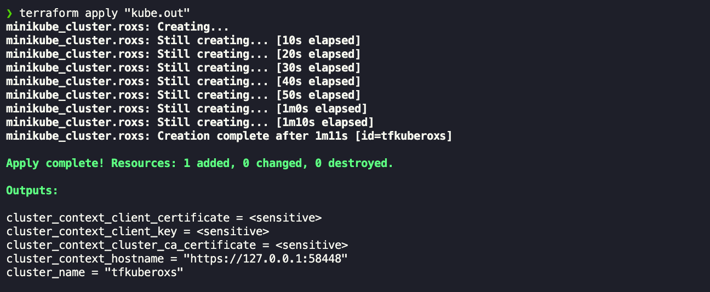
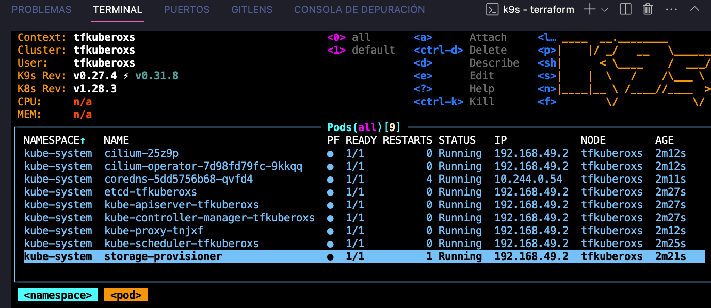
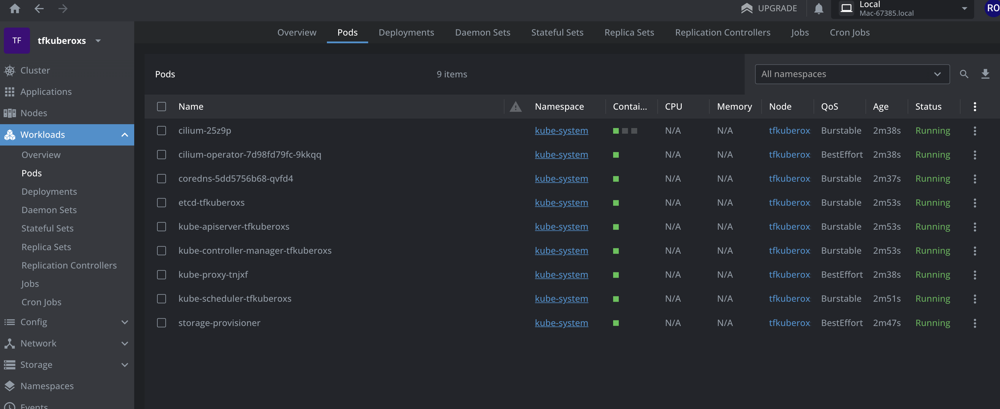

# TerrakubeRoxs by RoxsRoss


---


🔥🔥🔥🔥

### by RoxsRoss
---
# Terrakuberoxs

**Terraform:**

Terraform es una herramienta de infraestructura como código (IaC) que permite a los desarrolladores y operadores gestionar la infraestructura de manera eficiente y declarativa. Desarrollado por HashiCorp, Terraform permite definir la infraestructura deseada en un archivo de configuración, generalmente escrito en lenguaje HCL (HashiCorp Configuration Language). A través de la ejecución de comandos, Terraform crea, modifica y destruye recursos de manera automatizada, manteniendo un estado consistente y controlado de la infraestructura.

**Características clave:**
- Declarativo: Define la infraestructura deseada y Terraform se encarga de llevarla a ese estado.
- Multiplataforma: Compatible con diversos proveedores de servicios en la nube y tecnologías on-premise.
- Control de versiones: Permite la gestión del código de infraestructura mediante sistemas de control de versiones como Git.
- Planificación y aplicació: Terraform realiza una planificación antes de aplicar cambios, proporcionando una vista previa de las acciones que se llevarán a cabo.

**Minikube:**

Minikube es una herramienta que facilita la creación y gestión de clústeres de Kubernetes locales para el desarrollo y prueba de aplicaciones. Desarrollado para simplificar el proceso de desarrollo en entornos Kubernetes, Minikube permite a los desarrolladores ejecutar clústeres de Kubernetes en una máquina individual, lo que facilita la iteración y prueba de aplicaciones sin necesidad de un clúster completo.

**Características clave:**
- Desarrollo local: Permite a los desarrolladores trabajar con clústeres de Kubernetes en sus máquinas locales.
- Fácil instalación: Minikube se instala de manera sencilla y es compatible con diversas plataformas.
- Integración con proveedores de hipervisores: Puede utilizar diferentes proveedores, como Docker, VirtualBox, Hyper-V o KVM.
- Soporte para addons: Permite la adición de complementos para ampliar las capacidades del clúster local.

## Terraform y Minikube Onfire

Ahora se viene onfire con el provider de Minikube

¡Un proveedor de Terraform diseñado específicamente para Minikube!

El objetivo de este proyecto es permitir a los desarrolladores crear clústeres de Minikube e integrarlos con proveedores de Terraform comunes para Kubernetes, como hashicorp/kubernetes y hashicorp/helm, 

¡todo desde la comodidad de Minikube! Con esta herramienta, buscamos simplificar y mejorar la experiencia de desarrollo y despliegue de aplicaciones en entornos Kubernetes locales. 

¡Explora nuevas posibilidades y optimiza tu flujo de trabajo con el proveedor Minikube para Terraform!

Documentación [enlace](https://registry.terraform.io/providers/scott-the-programmer/minikube/latest/docs)

Repositorio [enlace](https://github.com/scott-the-programmer/terraform-provider-minikube)


### ¿Como funciona?

Solo debes incorporar el provider minikube y kubernetes

```hcl
terraform {
  required_version = "~> 1.7.0"

  required_providers {
    minikube = {
      source  = "scott-the-programmer/minikube"
      version = "~> 0.3.10"
    }
    kubernetes = {
      source  = "hashicorp/kubernetes"
      version = "~> 2.25.2"
    }
  }
}
```

Tambien puedes sumar kubectl, helm y muchos más y hacer magia

y no solo eso, se puede agregar nodos, addons y driver como CNI = cillium

Te recomiendo conectar el backend algun provider asi guardas los state


*Recuerda usar el ciclo de vida de terraform*

```markdown
1. **Inicialización:**
   ```bash
   terraform init
   ```
2. **Planificación:**
   ```bash
   terraform plan
   ```
3. **Aplicación:**
   ```bash
   terraform apply
   ```
4. **Validación:**
   ```bash
   terraform validate
   ```
5. **Destrucción:**
   ```bash
   terraform destroy
   ```

y podras usar el gestor preferido como k9s o lens para jugar con minikube

```
output
Changes to Outputs:
  + cluster_context_client_certificate     = (sensitive value)
  + cluster_context_client_key             = (sensitive value)
  + cluster_context_cluster_ca_certificate = (sensitive value)
  + cluster_context_hostname               = (known after apply)
  + cluster_name                           = "terrakuberoxs"
```

## Pasos

```
cd terraform
terraform init
```


```
terraform plan
```


```
terraform apply
```


Desde K9s



Desde Lens



Nodos que pudes agregar los que necesites, al final son contenedores


🔥🔥🔥🔥

 


### ✉️  &nbsp;Contactos 

Me puedes encontrar en:

[ ](https://blog.295devops.com)
[](https://dev.to/roxsross)

[](https://www.linkedin.com/in/roxsross/)
[](https://www.instagram.com/roxsross/)
[](https://www.youtube.com/channel/UCa-FcaB75ZtqWd1YCWW6INQ)


<samp>
"Para entender algo no debes entenderlo sino serlo"
<samp>
  </div>
  
   [](https://www.buymeacoffee.com/roxsross)
